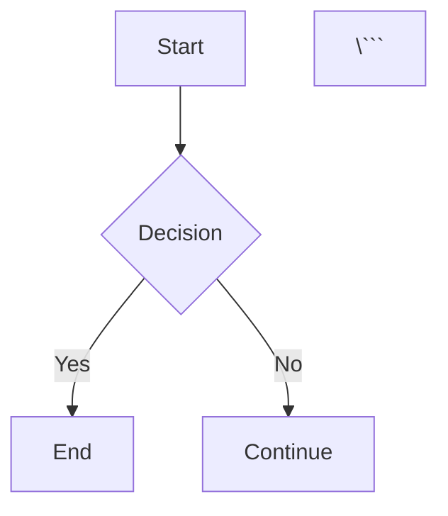

# mdviewer 📖

A beautiful, cross-platform terminal markdown viewer with Mermaid diagram support, built in Go.

## Features

- ✨ **Beautiful ANSI rendering** - Styled markdown output in your terminal
- 🎨 **Multiple themes** - Auto-detect, dark, light, or custom styles
- 📊 **Local Mermaid rendering** - Renders diagrams locally using chromedp (no internet required!)
- 📏 **Smart word wrapping** - Auto-detects terminal width
- 🚀 **Fast and lightweight** - Single binary with embedded mermaid.js
- 🔄 **Stdin support** - Pipe markdown content directly
- 🖨️ **PDF export** - Export markdown with rendered diagrams to PDF
- 🪟 **Cross-platform** - Works on macOS, Linux, and Windows

## Installation

### From Source

```bash
go install github.com/aquele_dinho/mdviewer/cmd/mdviewer@latest
```

### Build Locally

```bash
git clone https://github.com/aquele_dinho/mdviewer.git
cd mdviewer
go build -o mdviewer ./cmd/mdviewer
```

## Usage

### Basic Usage

```bash
# View a markdown file
mdviewer README.md

# Read from stdin
cat document.md | mdviewer
echo "# Hello World" | mdviewer

# Use with less for scrolling
mdviewer large-doc.md | less -R
```

### Options

```bash
# Use dark theme
mdviewer document.md --style dark

# Use light theme
mdviewer document.md --style light

# Use clean style (no hash prefixes on headings)
mdviewer document.md --style clean

# Custom terminal width
mdviewer document.md --width 100

# Disable mermaid detection
mdviewer document.md --no-mermaid

# Mermaid rendering modes
mdviewer document.md --mermaid-mode=terminal  # Default: Memory-only (inline or ASCII preview)
mdviewer document.md --mermaid-mode=svg       # Export SVGs to temp directory
mdviewer document.md --mermaid-mode=png       # Export PNGs to temp directory
mdviewer document.md --mermaid-mode=url       # Show URLs + code (no local rendering)

# Save Mermaid diagrams to disk (terminal mode only)
mdviewer document.md --keep-mermaid-files     # Saves SVG files to temp directory
mdviewer document.md -k --mermaid-output-dir=./diagrams  # Save to custom directory

# Export to PDF
mdviewer document.md --export-pdf output.pdf
```

### Help

```bash
mdviewer --help
mdviewer --version
```

## Supported Markdown Features

- **Headings** (H1-H6)
- **Bold**, *Italic*, `Code`
- Lists (ordered and unordered)
- Tables
- Blockquotes
- Code blocks with syntax highlighting
- Links
- Horizontal rules
- Mermaid diagrams (visual indicators)

## Mermaid Diagram Support

mdviewer now renders Mermaid diagrams **locally** using headless Chrome (chromedp). No internet connection required!

```markdown


### Rendering Modes

#### Terminal Mode (Default)
Displays diagrams inline (if your terminal supports it) or as an ASCII preview box. **Files are kept in memory by default** - no disk files are created unless you use `--keep-mermaid-files`:

**Inline Image Support** (auto-detected):
- ✅ **Warp Terminal** (iTerm2 protocol)
- ✅ **iTerm2** on macOS (iTerm2 protocol)
- ✅ **Kitty** terminal (Kitty graphics protocol)
- ✅ **Windows Terminal** v1.22+ (Sixel/iTerm2 protocol)
- ✅ **VSCode** integrated terminal (iTerm2 protocol)
- ✅ **WezTerm** (multiple protocols)

If your terminal supports inline images, diagrams will render directly in the output:
```
📊 Mermaid Diagram (Flowchart):
[actual rendered image appears here]
```

Otherwise, you'll see an ASCII info box:
```
┌──────────────────────────────────────────────────┐
│ 📊 Mermaid Diagram: Flowchart                   │
│ 📐 Dimensions: 232x334 px                        │
│ ✅ Rendered locally                              │
└──────────────────────────────────────────────────┘
```

**To save diagrams to disk**, use the `--keep-mermaid-files` flag:
```bash
mdviewer doc.md --keep-mermaid-files
# Files saved to system temp directory by default

mdviewer doc.md -k --mermaid-output-dir=./my-diagrams
# Files saved to custom directory
```

#### SVG Mode
Exports SVG files to disk (no terminal preview):
```bash
mdviewer doc.md --mermaid-mode=svg
# Files saved to system temp directory

mdviewer doc.md --mermaid-mode=svg --mermaid-output-dir=./diagrams
# Files saved to custom directory
```

#### PNG Mode
Exports diagrams as PNG images to disk:
```bash
mdviewer doc.md --mermaid-mode=png
# Files saved to system temp directory

mdviewer doc.md --mermaid-mode=png --mermaid-output-dir=./diagrams
# Files saved to custom directory
```

#### URL Mode (Fallback)
Shows the mermaid code + clickable URLs to mermaid.live and mermaid.ink:
```bash
mdviewer doc.md --mermaid-mode=url
```

### Supported Mermaid Diagram Types

- Flowcharts
- Sequence Diagrams
- Class Diagrams
- State Diagrams
- ER Diagrams
- Gantt Charts
- Pie Charts
- Git Graphs
- User Journey Maps

## Configuration

mdviewer uses Glamour for rendering. You can customize the appearance by:

1. Using built-in styles: `auto`, `dark`, `light`, `clean` (no hash prefixes)
2. Providing a path to a custom Glamour style JSON file

### Style Comparison

- **auto/dark/light**: Traditional styles that show `##` and `###` prefixes on H2/H3 headings
- **clean**: Modern style without hash prefixes, similar to GUI markdown viewers

## Examples

### View this README

```bash
mdviewer README.md
```

### Pipe content

```bash
curl https://raw.githubusercontent.com/username/repo/main/README.md | mdviewer
```

### Custom theme

```bash
mdviewer document.md --style /path/to/custom-style.json
```

## Project Structure

```
mdviewer/
├── cmd/
│   └── mdviewer/           # CLI entry point
├── internal/
│   ├── mermaid/            # Local Mermaid compiler (chromedp)
│   │   ├── assets/         # Embedded mermaid.min.js
│   │   ├── compiler.go     # Chromedp-based renderer
│   │   ├── svg.go          # SVG utilities
│   │   └── embed.go        # go:embed for mermaid.js
│   ├── renderer/           # Markdown rendering
│   ├── viewer/             # Display logic
│   ├── pdf/                # PDF export with chromedp
│   └── utils/              # File and terminal utilities
├── go.mod
└── README.md
```

## Development

### Prerequisites

- Go 1.21 or higher

### Building

```bash
go build -o mdviewer ./cmd/mdviewer
```

### Testing

```bash
go test ./...
```

## Roadmap

- [x] Basic markdown rendering
- [x] Mermaid diagram detection
- [x] **Local Mermaid rendering** (chromedp)
- [x] Multiple color themes
- [x] Terminal width auto-detection
- [x] Stdin support
- [x] PDF export with chromedp
- [x] SVG export for diagrams
- [ ] Interactive TUI mode with Bubbletea
- [ ] Search functionality
- [ ] Link navigation
- [ ] Terminal inline image support (iTerm2, Kitty)
- [ ] Watch mode for live updates
- [ ] Custom style editor

## Technologies

- [Glamour](https://github.com/charmbracelet/glamour) - Terminal markdown rendering
- [Cobra](https://github.com/spf13/cobra) - CLI framework
- [Goldmark](https://github.com/yuin/goldmark) - Markdown parser
- [Chromedp](https://github.com/chromedp/chromedp) - PDF generation (planned)

## Contributing

Contributions are welcome! Please feel free to submit a Pull Request.

## License

MIT License

## Author

Built with ❤️ by [@aquele_dinho](https://github.com/aquele_dinho)

## Acknowledgments

- The [Charm](https://charm.sh/) team for Glamour and Bubbletea
- The Go community for excellent libraries
