# Test Markdown Document

This is a **test document** for the `mdviewer` terminal markdown viewer.

## Features

- Beautiful ANSI rendering
- *Syntax highlighting*
- `Code blocks`
- And more!

### Code Example

```go
func main() {
    fmt.Println("Hello, World!")
}
```

### Mermaid Diagram


---




```mermaid
graph TD
    A[Início] --> B{É isso?}
    B -->|Sim| C[OK]
    B -->|Não| D[Fim]
```

## Tables

| Feature | Status |
|---------|--------|
| Markdown Rendering | ✅ |
| Mermaid Support | ✅ |
| PDF Export | 🚧 |

> **Note**: This is a blockquote to test styling.

---

## Links

- Default Syntax
[Label](./test.md)


- Obsidian Syntax
[[test]]


![[./diagram-1.png|400]]

![[./diagram-1.png]]

---

That's all for now!